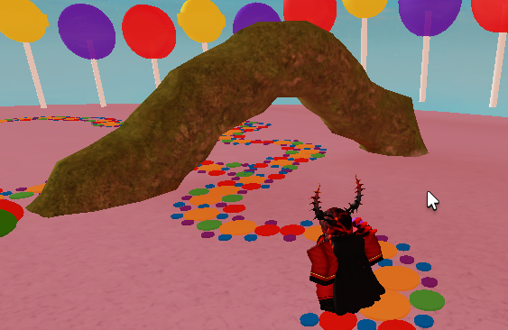
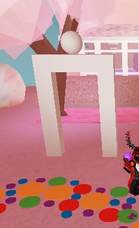
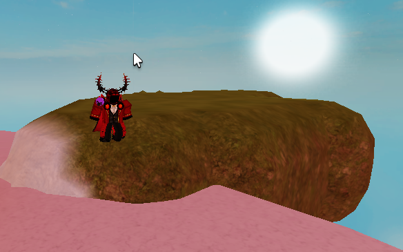
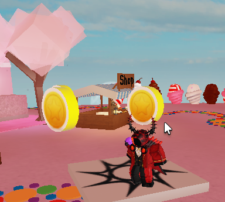

# 🧱 Projeto Roblox - Avaliação de Tutor 🎮

Este repositório contém minha solução para a **Atividade de Avaliação do Professor (Roblox)**.  
Aqui demonstro minhas habilidades no **Roblox Studio**, com foco em **modelagem**, **correção de scripts**, **animações**, e **uso de TweenScript** para movimentação de objetos no mundo 3D.

---

## ✨ O que foi feito?

### ✅ Etapa 1: Construções

- ✔️ Construção de **arcos** com lama e partes (`Parts`)
- ✔️ Criação de uma **caixa de ferramentas** com material de madeira
- ✔️ Criação de uma **saliência de terreno plano**, sem montanhas ou buracos profundos

#### Exemplos visuais:

| Arco com Lama | Arco com Parts |
|---------------|----------------|
|  |  |

| Caixa de Ferramentas | Terreno Plano |
|----------------------|----------------|
|  |  |

---

### ✅ Etapa 2: Correções e Funcionalidades

- ✔️ Corrigido bug que **não somava as moedas** coletadas
- ✔️ Corrigido bug onde o **preço do boost de velocidade não era descontado**
- ✔️ Criada **animação de rotação para as moedas**
- ✔️ Adicionado **TweenScript** para mover plataforma entre ilhas

| Moeda Animada |
|----------------|
|  |

---

## 🎥 Demonstração em Vídeo

Assista ao vídeo com todas as funcionalidades aplicadas e correções realizadas:

---

## 📁 Como testar

1. Faça o download dos arquivos do projeto clicando em `Code > Download ZIP` ou clonando este repositório.
2. Abra o projeto no **Roblox Studio**.
3. Explore o mundo e veja as funcionalidades implementadas.

---

## 🧠 Objetivo

Este projeto foi desenvolvido como parte de uma avaliação para **tutor de Roblox**.  
Aqui demonstro minhas habilidades com **correções de código**, **animações**, **uso de materiais**, e **movimentação com TweenScript** — tudo com foco na didática e domínio da plataforma.

---

**Obrigado por visitar este repositório! Qualquer dúvida ou feedback, sinta-se à vontade para abrir uma issue. 😊**
